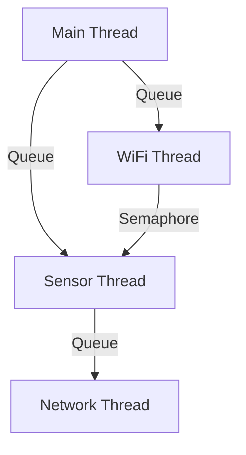
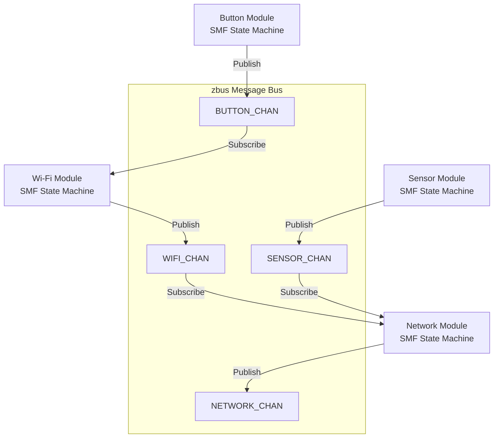
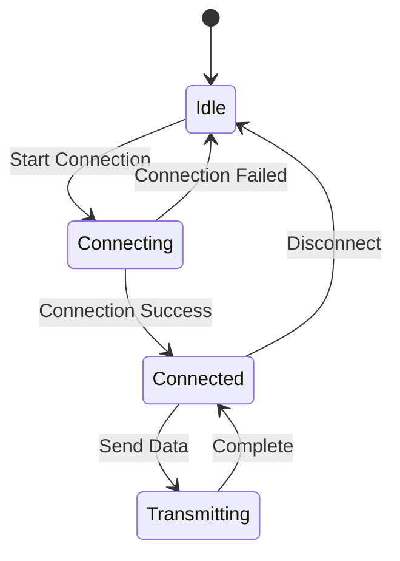
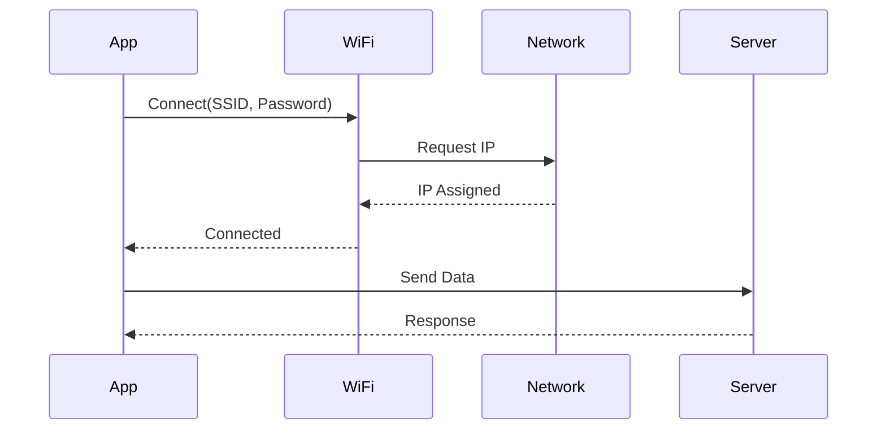

# Product Requirements Document (PRD)

## Document Information

- **Product Name**: [Product Name]
- **Product ID**: [Unique ID]
- **Document Version**: [Version]
- **Date Created**: [Creation Date]
- **Product Manager**: [Name]
- **Status**: [Draft / In Review / Approved / Released]
- **Target Release**: [Release Version / Date]

---

## 1. Executive Summary

### 1.1 Product Overview

**Brief description of the product, its purpose, and target market.**

[1-2 paragraph summary]

### 1.2 Problem Statement

**What problem does this product solve?**

[Description of the problem and pain points]

### 1.3 Target Users

**Who will use this product?**

- **Primary Users**: [Description]
- **Secondary Users**: [Description]
- **User Personas**: [Link to personas or brief description]

### 1.4 Success Metrics

| Metric | Target | Measurement Method |
|--------|--------|-------------------|
| [Metric 1] | [Target value] | [How to measure] |
| [Metric 2] | [Target value] | [How to measure] |

---

## 2. Product Requirements

### 2.1 Feature Selection & Technical Stack

Select the features required for this project. This drives architecture, configuration, and test planning.

> **Reference**: See `FEATURE_QUICK_REF.md` for memory requirements and dependencies.
> **Detailed Guide**: See `guides/FEATURE_SELECTION.md` for code examples and configuration details.

#### Core Wi-Fi Features (nRF70 Series)

| Feature | Selected | Config Option | Description | Flash | RAM |
|---------|----------|---------------|-------------|-------|-----|
| Wi-Fi Shell | ☐ | `CONFIG_WIFI=y`<br>`CONFIG_NET_L2_WIFI_SHELL=y` | Wi-Fi management via shell commands | ~5 KB | ~2 KB |
| Wi-Fi STA | ☐ | `CONFIG_WIFI=y`<br>`CONFIG_WIFI_NM_WPA_SUPPLICANT=y` | Station mode - connect to AP | ~60 KB | ~40 KB |
| Wi-Fi SoftAP | ☐ | `CONFIG_NRF70_AP_MODE=y`<br>`CONFIG_WIFI_NM_WPA_SUPPLICANT_AP=y` | Create access point for clients | ~65 KB | ~50 KB |
| Wi-Fi P2P | ☐ | `CONFIG_WIFI_NM_WPA_SUPPLICANT_P2P=y` | Wi-Fi Direct peer-to-peer | ~70 KB | ~45 KB |
| Wi-Fi Scan | ☐ | `CONFIG_NRF_WIFI_SCAN_MAX_BSS_CNT=20` | Network scanning | ~5 KB | ~10 KB |
| Wi-Fi Monitor Mode | ☐ | `CONFIG_NRF70_MONITOR_MODE=y` | Packet monitoring/sniffing | ~10 KB | ~15 KB |
| Wi-Fi Low Power | ☐ | `CONFIG_NRF_WIFI_LOW_POWER=y` | Power management | - | - |

#### Network Protocol Features

| Feature | Selected | Config Option | Description | Flash | RAM |
|---------|----------|---------------|-------------|-------|-----|
| IPv4 | ☐ | `CONFIG_NET_IPV4=y` | IPv4 networking | ~15 KB | ~5 KB |
| IPv6 | ☐ | `CONFIG_NET_IPV6=y` | IPv6 networking | ~25 KB | ~10 KB |
| UDP | ☐ | `CONFIG_NET_UDP=y` | User Datagram Protocol | ~5 KB | ~2 KB |
| TCP | ☐ | `CONFIG_NET_TCP=y` | Transmission Control Protocol | ~20 KB | ~10 KB |
| MQTT | ☐ | `CONFIG_MQTT_LIB=y` | MQTT client | ~15 KB | ~8 KB |
| HTTP Client | ☐ | `CONFIG_HTTP_CLIENT=y` | HTTP client for REST APIs | ~10 KB | ~5 KB |
| HTTP Server | ☐ | `CONFIG_HTTP_SERVER=y` | HTTP server | ~25 KB | ~20 KB |
| WebSocket | ☐ | `CONFIG_WEBSOCKET_CLIENT=y` | WebSocket client | ~8 KB | ~5 KB |
| CoAP | ☐ | `CONFIG_COAP=y` | Constrained Application Protocol | ~12 KB | ~6 KB |
| LwM2M | ☐ | `CONFIG_LWM2M=y` | Lightweight M2M protocol | ~40 KB | ~15 KB |
| DHCP Client | ☐ | `CONFIG_NET_DHCPV4=y` | DHCP client | ~8 KB | ~4 KB |
| DHCP Server | ☐ | `CONFIG_NET_DHCPV4_SERVER=y` | DHCP server for SoftAP | ~12 KB | ~8 KB |
| DNS Client | ☐ | `CONFIG_DNS_RESOLVER=y` | DNS resolution | ~6 KB | ~3 KB |
| mDNS | ☐ | `CONFIG_MDNS_RESPONDER=y` | Multicast DNS | ~10 KB | ~5 KB |
| SNTP | ☐ | `CONFIG_SNTP=y` | Simple Network Time Protocol | ~5 KB | ~2 KB |

#### Cellular Features (nRF91 Series)

| Feature | Selected | Config Option | Description | Flash | RAM |
|---------|----------|---------------|-------------|-------|-----|
| LTE Link Control | ☐ | `CONFIG_LTE_LINK_CONTROL=y` | LTE modem control | ~20 KB | ~10 KB |
| Modem Info | ☐ | `CONFIG_MODEM_INFO=y` | Modem information | ~5 KB | ~2 KB |
| SMS | ☐ | `CONFIG_SMS=y` | SMS messaging | ~8 KB | ~4 KB |
| GNSS | ☐ | `CONFIG_NRF_CLOUD_GNSS=y` | GPS/GNSS location | ~15 KB | ~8 KB |
| A-GNSS | ☐ | `CONFIG_NRF_CLOUD_AGPS=y` | Assisted GPS | ~10 KB | ~5 KB |
| P-GPS | ☐ | `CONFIG_NRF_CLOUD_PGPS=y` | Predicted GPS | ~12 KB | ~6 KB |

#### Bluetooth Features

| Feature | Selected | Config Option | Description | Flash | RAM |
|---------|----------|---------------|-------------|-------|-----|
| BLE | ☐ | `CONFIG_BT=y` | Bluetooth Low Energy | ~40 KB | ~20 KB |
| BLE Central | ☐ | `CONFIG_BT_CENTRAL=y` | BLE central role | ~5 KB | ~3 KB |
| BLE Peripheral | ☐ | `CONFIG_BT_PERIPHERAL=y` | BLE peripheral role | ~5 KB | ~3 KB |
| BLE GATT | ☐ | `CONFIG_BT_GATT_CLIENT=y` | GATT client | ~8 KB | ~4 KB |
| BLE Mesh | ☐ | `CONFIG_BT_MESH=y` | Bluetooth Mesh | ~60 KB | ~30 KB |
| NUS (UART Service) | ☐ | `CONFIG_BT_NUS=y` | Nordic UART Service | ~3 KB | ~2 KB |

#### Security & Crypto Features

| Feature | Selected | Config Option | Description | Flash | RAM |
|---------|----------|---------------|-------------|-------|-----|
| TLS/DTLS | ☐ | `CONFIG_MBEDTLS=y` | TLS/DTLS encryption | ~80 KB | ~40 KB |
| PSA Crypto | ☐ | `CONFIG_PSA_CRYPTO_DRIVER_ALG_ENABLE=y` | Platform Security Arch | ~30 KB | ~10 KB |
| Secure Boot | ☐ | `CONFIG_SECURE_BOOT=y` | Bootloader security | ~15 KB | - |
| HW Crypto | ☐ | `CONFIG_HW_CC3XX=y` | Hardware crypto (nRF91) | - | - |

#### Cloud & IoT Services

| Feature | Selected | Config Option | Description | Flash | RAM |
|---------|----------|--------------|-------------|-------|-----|
| nRF Cloud | ☐ | `CONFIG_NRF_CLOUD=y` | Nordic cloud integration | ~35 KB | ~15 KB |
| AWS IoT | ☐ | `CONFIG_AWS_IOT=y` | AWS IoT Core | ~40 KB | ~20 KB |
| Azure IoT Hub | ☐ | `CONFIG_AZURE_IOT_HUB=y` | Microsoft Azure IoT | ~45 KB | ~25 KB |
| Google Cloud IoT | ☐ | `CONFIG_CLOUD_API=y` | Google Cloud Platform | ~35 KB | ~18 KB |
| Memfault | ☐ | `CONFIG_MEMFAULT=y` | Device monitoring & debugging | ~30 KB | ~12 KB |

#### Storage & File System

| Feature | Selected | Config Option | Description | Flash | RAM |
|---------|----------|---------------|-------------|-------|-----|
| Flash | ☐ | `CONFIG_FLASH=y` | Flash memory access | ~5 KB | ~2 KB |
| NVS | ☐ | `CONFIG_NVS=y` | Non-volatile storage | ~8 KB | ~3 KB |
| Settings | ☐ | `CONFIG_SETTINGS=y` | Settings subsystem | ~10 KB | ~4 KB |
| FCB | ☐ | `CONFIG_FCB=y` | Flash Circular Buffer | ~6 KB | ~2 KB |
| LittleFS | ☐ | `CONFIG_FILE_SYSTEM_LITTLEFS=y` | LittleFS file system | ~25 KB | ~10 KB |
| FAT FS | ☐ | `CONFIG_FILE_SYSTEM_FAT=y` | FAT file system | ~40 KB | ~15 KB |

#### Development & Debugging

| Feature | Selected | Config Option | Description | Flash | RAM |
|---------|----------|---------------|-------------|-------|-----|
| Shell | ☐ | `CONFIG_SHELL=y` | Interactive shell | ~15 KB | ~8 KB |
| Logging | ☐ | `CONFIG_LOG=y` | Logging subsystem | ~10 KB | ~5 KB |
| Assert | ☐ | `CONFIG_ASSERT=y` | Runtime assertions | ~2 KB | - |
| Thread Analyzer | ☐ | `CONFIG_THREAD_ANALYZER=y` | Thread monitoring | ~5 KB | ~3 KB |
| CPU Stats | ☐ | `CONFIG_THREAD_RUNTIME_STATS=y` | CPU usage statistics | ~3 KB | ~2 KB |
| Stack Sentinel | ☐ | `CONFIG_STACK_SENTINEL=y` | Stack overflow detection | ~1 KB | - |

#### State Management & Architecture

| Feature | Selected | Config Option | Description | Flash | RAM |
|---------|----------|---------------|-------------|-------|-----|
| SMF | ☐ | `CONFIG_SMF=y` | State Machine Framework | ~4 KB | ~2 KB |
| Zbus | ☐ | `CONFIG_ZBUS=y` | Message bus | ~6 KB | ~3 KB |
| Event Manager | ☐ | `CONFIG_EVENT_MANAGER=y` | Event-driven architecture | ~8 KB | ~4 KB |

#### Peripheral & Sensors

| Feature | Selected | Config Option | Description | Flash | RAM |
|---------|----------|---------------|-------------|-------|-----|
| GPIO | ☐ | `CONFIG_GPIO=y` | GPIO control | ~3 KB | ~1 KB |
| I2C | ☐ | `CONFIG_I2C=y` | I2C bus | ~4 KB | ~2 KB |
| SPI | ☐ | `CONFIG_SPI=y` | SPI bus | ~5 KB | ~2 KB |
| UART | ☐ | `CONFIG_UART=y` | UART serial | ~4 KB | ~2 KB |
| ADC | ☐ | `CONFIG_ADC=y` | Analog-to-Digital | ~5 KB | ~2 KB |
| PWM | ☐ | `CONFIG_PWM=y` | Pulse Width Modulation | ~4 KB | ~2 KB |
| Sensor API | ☐ | `CONFIG_SENSOR=y` | Generic sensor framework | ~8 KB | ~4 KB |
| DK Library | ☐ | `CONFIG_DK_LIBRARY=y` | Dev kit buttons/LEDs | ~3 KB | ~1 KB |

#### Build Command

Based on selected features, your project configuration is specified in `prj.conf`.

**Standard Build**:
```bash
west build -p -b <board_name>
```

**With Additional Overlay**:
```bash
west build -p -b <board_name> -- -DEXTRA_CONF_FILE="overlay-feature.conf"
```

**Multiple Overlays**:
```bash
west build -p -b <board_name> -- \
  -DEXTRA_CONF_FILE="overlay-1.conf;overlay-2.conf;overlay-3.conf"
```

**Supported Boards**:

**Wi-Fi Development (nRF70 Series)**:
- `nrf7002dk/nrf5340/cpuapp` - nRF7002 DK (Wi-Fi 6, nRF5340 + nRF7002)
- `nrf54l15dk/nrf54l15/cpuapp` - nRF54L15 DK + nRF7002EB (Wi-Fi 6 via external board)
- `nrf54lm20dk/nrf54lm20/cpuapp` - nRF54LM20 DK + nRF7002EB (Wi-Fi 6 via external board)

**Cellular Development (nRF91 Series)**:
- `nrf9160dk/nrf9160/ns` - nRF9160 DK (LTE-M/NB-IoT)
- `nrf9161dk/nrf9161/ns` - nRF9161 DK (LTE-M/NB-IoT)
- `thingy91/nrf9160/ns` - Thingy:91 (LTE-M/NB-IoT)

### 2.2 Functional Requirements

**Must Have (P0)**

| ID | User Story | Acceptance Criteria | Related Feature |
|----|------------|---------------------|-----------------||
| FR-001 | As a user, I want to [action] so that [benefit] | - Criteria 1<br>- Criteria 2 | [Feature] |
| FR-002 | As a user, I want to [action] so that [benefit] | - Criteria 1<br>- Criteria 2 | [Feature] |

**Should Have (P1)**

| ID | User Story | Acceptance Criteria | Related Feature |
|----|------------|---------------------|-----------------||
| FR-101 | As a user, I want to [action] so that [benefit] | - Criteria 1<br>- Criteria 2 | [Feature] |

**Nice to Have (P2)**

| ID | User Story | Acceptance Criteria | Related Feature |
|----|------------|---------------------|-----------------||
| FR-201 | As a user, I want to [action] so that [benefit] | - Criteria 1<br>- Criteria 2 | [Feature] |

### 2.3 Non-Functional Requirements

#### Performance
- **Metric 1**: Specification (e.g., latency < 10ms)
- **Metric 2**: Specification (e.g., throughput > 1Mbps)

#### Power Consumption
- **Active Mode**: Target consumption
- **Sleep Mode**: Target consumption
- **Average**: Target consumption

#### Memory
- **Flash**: Target size (e.g., < 256KB)
- **RAM**: Target size (e.g., < 128KB)
- **Heap**: Target size

#### Reliability
- **MTBF**: Mean Time Between Failures
- **Uptime**: Target uptime percentage
- **Error Rate**: Acceptable error rate

### 2.4 Hardware Requirements

**Target Hardware**:

| Component | Model/Specification | Quantity | Notes |
|-----------|---------------------|----------|-------|
| Development Kit | [e.g., nRF7002DK] | 1 | Primary target |
| MCU | [Model and variant] | 1 | Required features |
| Sensor | [Model] | X | Interface type |
| Power Supply | [Specification] | 1 | Voltage requirements |

**Memory Requirements** (based on selected features):
- **Flash**: [X] KB (Available: [Y] KB)
- **RAM**: [X] KB (Available: [Y] KB)
- **Heap**: [X] KB

### 2.5 User Experience Requirements

**User Interface**:
- [Description of UI requirements]
- [Interaction patterns]
- [Accessibility requirements]

**User Flows**:
1. [Primary user flow]
2. [Secondary user flow]

---

## 3. Technical Specification

> **Note**: This section is filled in collaboration with Engineering team

### 3.1 Architecture Design

#### 3.1.1 Architecture Pattern Selection

Select the architectural pattern for this project:

| Pattern | Selected | Description | Best For |
|---------|----------|-------------|----------|
| Simple Multi-Threaded | ☐ | Traditional threads with direct communication (queues, semaphores) | Simple applications, quick prototypes, 1-3 modules |
| SMF + zbus Modular | ☐ | State machines with message-based communication | Complex applications, scalable systems, 4+ modules |

> **Reference**: See `guides/ARCHITECTURE_PATTERNS.md` for detailed comparison and implementation guide.

#### Selected Pattern: [Fill in selected pattern name]

**Justification**: [Why this pattern was chosen for this project]

**Trade-offs**:
- Pros: [List advantages]
- Cons: [List disadvantages]

#### 3.1.2 System Architecture

#### Simple Multi-Threaded Pattern



**Description**: Traditional multi-threaded architecture with direct communication.

#### SMF + zbus Modular Pattern



**Description**: Modular architecture with State Machine Framework and message-based communication.

#### 3.1.3 Software Architecture

**Layers**:
- **Application Layer**: Business logic and state machines
- **Communication Layer**: zbus message channels (if SMF+zbus) or queues/semaphores (if multi-threaded)
- **Network Layer**: Communication protocols
- **Driver Layer**: Hardware abstraction
- **RTOS Layer**: Zephyr RTOS

#### 3.1.4 Module Descriptions

#### Module 1: [Name]
- **Purpose**: What it does
- **Inputs**: What it receives
- **Outputs**: What it produces
- **Dependencies**: Other modules it depends on
- **Files**: `module1.c`, `module1.h`

#### Module 2: [Name]
- **Purpose**: What it does
- **Inputs**: What it receives
- **Outputs**: What it produces
- **Dependencies**: Other modules it depends on
- **Files**: `module2.c`, `module2.h`

#### 3.1.5 State Machines



#### 3.1.6 Sequence Diagrams



---

## 4. Development Plan

### 4.1 Milestones

| Milestone | Target Date | Deliverables | Status |
|-----------|-------------|--------------|--------|
| M1: Prototype | [Date] | - Feature 1<br>- Feature 2 | Planned |
| M2: Alpha | [Date] | - Feature 3<br>- Feature 4 | Planned |
| M3: Beta | [Date] | - All features<br>- Testing | Planned |
| M4: Release | [Date] | - Production ready | Planned |

### 4.2 Dependencies & Risks

**Dependencies**:
- [Dependency 1]: [Description and impact]
- [Dependency 2]: [Description and impact]

**Risks**:

| Risk | Impact | Probability | Mitigation |
|------|--------|-------------|------------|
| [Risk 1] | High/Medium/Low | High/Medium/Low | [Mitigation strategy] |
| [Risk 2] | High/Medium/Low | High/Medium/Low | [Mitigation strategy] |

### 4.3 Resource Requirements

**Team**:
- Product Manager: [Name]
- Engineering Lead: [Name]
- Developers: [Count/Names]
- QA: [Count/Names]
- Designer: [Name]

**External Resources**:
- [Resource 1]
- [Resource 2]

---

## 5. API Documentation (Technical Reference)

### 5.1 Module 1 API

#### Function: `function_name()`

**Purpose**: Brief description

**Prototype**:
```c
int function_name(param_type param1, param_type param2);
```

**Parameters**:
- `param1`: Description
- `param2`: Description

**Return Values**:
- `0`: Success
- `-ERRNO`: Error description

**Example**:
```c
int result = function_name(value1, value2);
if (result < 0) {
    LOG_ERR("Function failed: %d", result);
}
```

**Notes**: Additional information, constraints, or warnings

---

## 6. Configuration Guide

### 6.1 Kconfig Options

| Option | Type | Default | Description |
|--------|------|---------|-------------|
| `CONFIG_FEATURE1` | bool | n | Enable feature 1 |
| `CONFIG_PARAM1` | int | 1000 | Parameter description |
| `CONFIG_PARAM2` | string | "default" | Parameter description |

### 6.2 Device Tree Configuration

```dts
/ {
    custom_node {
        compatible = "vendor,device";
        property1 = <value>;
        property2 = <value>;
    };
};
```

### 6.3 Build Configurations

**Default Build**:
```bash
west build -p -b board_name
```

**Feature-Specific Builds**:

| Configuration | Overlay File | Use Case |
|---------------|--------------|----------|
| Feature 1 | `overlay-feature1.conf` | Description |
| Feature 2 | `overlay-feature2.conf` | Description |

---

## 7. Quality Assurance

### 7.1 Test Plan

#### 7.1.1 Test Strategy

- **Unit Tests**: Module-level testing
- **Integration Tests**: Inter-module testing
- **System Tests**: End-to-end testing
- **Performance Tests**: Benchmarking

#### 7.1.2 Test Cases

#### TC-001: Wi-Fi Reconnection after Router Power Cycle (Real-life Scenario)

**Objective**: Verify device robustly handles router power loss and automatically reconnects when service returns.

**Prerequisites**:
- Device connected to Test Router (AP)
- Serial logging enabled for monitoring
- Router power strip accessible

**Test Steps**:
1. Confirm device is connected to AP and IP address is assigned.
2. Unplug power source of the Test Router (simulate power outage).
3. Observe device logs for disconnection event (e.g., `WIFI_EVENT_DISCONNECTED`).
4. Wait for 5 minutes (keep router off). Verify device enters reconnection backoff loop.
   - *Requirement*: Device should NOT panic or crash.
   - *Requirement*: Reconnection attempts should retry at intervals (e.g., every 3 minutes) to conserve power/bandwidth, rather than rigid continuous looping.
5. Plug Test Router power back in.
6. Wait for Router to boot (approx. 1-2 mins).
7. Observe device automatically reconnecting once beacon is detected.

**Expected Results**:
- Device detects disconnection within X seconds.
- Device enters robust reconnection state machine without crashing.
- Device successfully reconnects and obtains IP address after router comes back online.

**Actual Results**:
- [To be filled during testing]

**Status**: [Pass / Fail / Not Tested]

**Notes**: Test with multiple router brands (TP-Link, Asus, Netgear) if possible to verify behavior with different beacon startup timings.

#### TC-002: [Test Case Name]

**Objective**: What is being tested

#### 7.1.3 Test Results Summary

| Test ID | Description | Status | Date | Tester |
|---------|-------------|--------|------|--------|
| TC-001 | Test description | Pass/Fail | Date | Name |
| TC-002 | Test description | Pass/Fail | Date | Name |

#### 7.1.4 Coverage Metrics

- **Code Coverage**: XX%
- **Branch Coverage**: XX%
- **Function Coverage**: XX%

### 7.2 Acceptance Criteria

**Definition of Done**:
- [ ] All P0 features implemented
- [ ] All test cases pass
- [ ] Code review completed
- [ ] Documentation complete
- [ ] Performance metrics met
- [ ] Security review passed

---

## 8. User Documentation

### 8.1 Getting Started

#### Hardware Setup
1. Step-by-step hardware assembly
2. Connections and wiring
3. Power requirements

#### Software Setup
1. Development environment setup
2. Building the firmware
3. Flashing instructions

### 8.2 Operation Guide

#### Normal Operation
1. Power on sequence
2. Configuration steps
3. Operating procedures

#### Advanced Features
- Feature 1 usage
- Feature 2 usage

### 8.3 Troubleshooting

| Symptom | Possible Cause | Solution |
|---------|---------------|----------|
| Issue 1 | Cause description | Resolution steps |
| Issue 2 | Cause description | Resolution steps |

### 8.4 FAQ

**Q: Question 1?**
A: Answer description

**Q: Question 2?**
A: Answer description

---

## 9. Release & Maintenance

### 9.1 CI/CD Automation

> **Workspace Application Requirement**: Every release-ready NCS project must follow the [workspace application pattern](https://docs.nordicsemi.com/bundle/ncs-latest/page/nrf/app_dev/create_application.html#workspace_application) with automated CI/CD.

**Required CI/CD Components**:

1. **`west.yml` Manifest**
   - Pin `sdk-nrf` revision (e.g., `v3.2.1`)
   - Enable reproducible builds
   - Support `west init -l <app>` workflow

2. **GitHub Actions Workflow** (`.github/workflows/build.yml`)
   - Extract NCS version from `west.yml`
   - Use official container: `ghcr.io/nrfconnect/sdk-nrf-toolchain:${NCS_VERSION}`
   - Build all supported board configurations
   - Run quality gates before merge

3. **Quality Gates** (Mandatory for PR approval)
   - ✅ Documentation validation (README structure, required files)
   - ✅ Static analysis (Zephyr checkpatch)
   - ✅ Code formatting (clang-format with Zephyr rules)
   - ✅ Build success for all target boards

4. **Automated Release** (on version tags)
   - Generate changelog from git history
   - Build firmware for all boards
   - Create release packages (`.hex` per board, combined `.zip`)
   - Publish GitHub Release with auto-generated notes

**Typical Workflow Structure**:
```yaml
jobs:
  set-version:       # Extract NCS version from west.yml
  build-and-test:    # Matrix build for all boards
  validate-documentation:  # Check README & config files
  static-analysis:   # Run checkpatch & clang-format
  create-release:    # Auto-release on tags (depends on all above)
```

**Release Process**:
```bash
# 1. Update version documentation
# 2. Create and push version tag
git tag -a v1.0.0 -m "Release v1.0.0"
git push origin v1.0.0
# 3. CI automatically builds, tests, and releases
```

**Quality Metrics**:
- All PRs blocked until CI passes
- Zero tolerance for formatting violations
- Documentation completeness enforced
- Release artifacts reproducible from tags

**Reference Implementation**: See [`nordic_wifi_opus_audio_demo/.github/workflows/build.yml`](https://github.com/chshzh/nordic_wifi_opus_audio_demo/blob/main/.github/workflows/build.yml) or [`nordic_wifi_softap_webserver/.github/workflows/build.yml`](https://github.com/chshzh/nordic_wifi_softap_webserver/blob/main/.github/workflows/build.yml)

### 9.2 Version History

| Version | Date | Author | Changes |
|---------|------|--------|---------|
| 1.0.0 | Date | Name | Initial release |
| 1.1.0 | Date | Name | Feature additions |

### 9.3 Known Limitations

| Issue ID | Description | Severity | Workaround | Status |
|----------|-------------|----------|------------|--------|
| ISS-001 | Issue description | High/Medium/Low | Workaround | Open/Fixed |

### 9.4 Product Roadmap

- **Version X.X**: Planned features
- **Future**: Long-term plans

### 9.5 Support & Maintenance Plan

- **Support Channels**: [List channels]
- **Update Frequency**: [Schedule]
- **End of Life**: [Policy]

---

## 10. References

### 10.1 Internal Documents
- [Document Name](link)
- [Document Name](link)

### 10.2 External Resources
- [Nordic nRF Connect SDK Documentation](https://developer.nordicsemi.com/)
- [Zephyr Project Documentation](https://docs.zephyrproject.org/)
- [Relevant Standards or Specifications]

### 10.3 Related Projects
- [Project Name](link)
- [Project Name](link)

---

## 11. Appendices

### Appendix A: Glossary

| Term | Definition |
|------|------------|
| Term 1 | Definition |
| Term 2 | Definition |

### Appendix B: Abbreviations

| Abbreviation | Full Form |
|--------------|-----------|
| NCS | nRF Connect SDK |
| PRD | Product Requirements Document |

### Appendix C: Schematics

[Include circuit diagrams, pinout diagrams, etc.]

### Appendix D: Code Examples

[Include relevant code snippets or examples]

---

---

## Document Approval

| Role | Name | Signature | Date |
|------|------|-----------|------|
| Product Manager | [Name] | | |
| Engineering Lead | [Name] | | |
| QA Lead | [Name] | | |
| Stakeholder | [Name] | | |

---

**Document Control**:
- **Last Updated**: [Date]
- **Review Cycle**: [Monthly / Quarterly]
- **Next Review**: [Date]
- **Change Log**: See Section 9.1
