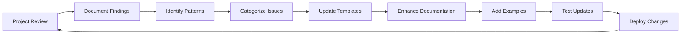

# Improving ncs-project-generate from Review Findings

This document guides the process of updating the ncs-project-generate skill based on insights from project reviews.

---

## Feedback Loop Process



---

## Collecting Review Insights

### After Each Review

**Document the following:**

1. **Common Issues Found**
   - Missing configurations
   - Incorrect patterns
   - Documentation gaps
   - Security oversights

2. **Best Practices Observed**
   - Excellent code patterns
   - Clear documentation
   - Good architecture
   - Effective configurations

3. **Template Gaps**
   - What templates didn't cover
   - Where developers struggled
   - Missing examples
   - Unclear guidance

4. **Improvement Opportunities**
   - Better defaults
   - Additional overlays
   - Enhanced documentation
   - Automation possibilities

---

## Common Review Findings → Template Updates

### Finding: Insufficient Wi-Fi Memory Configuration

**Review Observation**:
- Multiple projects had heap < 80KB
- Wi-Fi failures due to low memory
- Developers unaware of requirement

**Template Update**:

**File**: `ncs-project-generate/WIFI_GUIDE.md`

Add prominent memory warning:
```markdown
## ⚠️ CRITICAL: Wi-Fi Memory Requirements

Wi-Fi applications REQUIRE minimum memory configuration:

- `CONFIG_HEAP_MEM_POOL_SIZE=80000` (minimum 80KB)
- `CONFIG_NRF_WIFI_CTRL_HEAP_SIZE=40000`
- `CONFIG_NRF_WIFI_DATA_HEAP_SIZE=100000`

**Common symptom of insufficient memory**: "Out of memory" errors during connection.
```

**File**: `ncs-project-generate/CONFIG_TEMPLATES.md`

Update Wi-Fi overlay with comments:
```properties
# CRITICAL: Wi-Fi requires minimum 80KB heap
# Symptoms of insufficient memory:
# - Connection failures
# - "Out of memory" errors
# - Unstable operation
CONFIG_HEAP_MEM_POOL_SIZE=80000  # DO NOT REDUCE below 80000
```

---

### Finding: Hardcoded Credentials in Code

**Review Observation**:
- Credentials hardcoded in overlay files
- Overlay files committed to git
- Security vulnerability

**Template Update**:

**File**: `ncs-project-generate/.gitignore`

Add section:
```gitignore
# Credential overlays (DO NOT COMMIT)
overlay-wifi-credentials.conf
overlay-credentials.conf
*-credentials.conf
local_*.conf
```

**File**: `ncs-project-generate/WIFI_GUIDE.md`

Add security warning:
````markdown
## 🔒 CRITICAL: Never Commit Credentials

**BAD - Never do this**:
```properties
# overlay-wifi.conf
CONFIG_WIFI_CREDENTIALS_STATIC_SSID="MyWiFi"
CONFIG_WIFI_CREDENTIALS_STATIC_PASSWORD="password123"
```

**GOOD - Use runtime configuration**:
```bash
# At runtime via shell
uart:~$ wifi cred add -s "MyWiFi" -p "password123" -k 1
uart:~$ wifi cred auto_connect
```

**ACCEPTABLE - Local overlay in .gitignore**:
```properties
# overlay-wifi-local.conf (add to .gitignore)
CONFIG_WIFI_CREDENTIALS_STATIC_SSID="MyWiFi"
CONFIG_WIFI_CREDENTIALS_STATIC_PASSWORD="password123"
```
````

**New File**: `ncs-project-generate/SECURITY_GUIDE.md`

Create comprehensive security guidance.

---

### Finding: Incomplete README Documentation

**Review Observation**:
- READMEs missing hardware requirements
- No troubleshooting sections
- Build commands incorrect/outdated

**Template Update**:

**File**: `ncs-project-generate/README_TEMPLATE.md`

Enhance with mandatory sections marker:
```markdown
## 🔧 Hardware Requirements **(REQUIRED SECTION)**

### Essential Hardware (MUST)
| Component | Specification | Quantity | Notes |
|-----------|---------------|----------|-------|
| **Board** | Board name | 1 | Main development board |
| **Shield** | Shield name (if any) | 1 | E.g., nRF7002 EK |

### Optional Hardware
- Item 1: Purpose

**⚠️ Important Notes**:
- List any hardware modifications needed
- Note power requirements
- Mention any compatibility issues
```

Add troubleshooting template:
```markdown
## 🐛 Troubleshooting **(REQUIRED SECTION)**

### Build Issues

**Issue**: Build fails with "XXX not found"
- **Cause**: Missing dependency
- **Solution**: Run `west update`

**Issue**: Kconfig error
- **Cause**: Invalid configuration
- **Solution**: Check prj.conf syntax

### Runtime Issues

**Issue**: Connection fails
- **Cause**: Wrong credentials
- **Solution**: Verify SSID/password

**Issue**: Out of memory
- **Cause**: Insufficient heap
- **Solution**: Increase HEAP_MEM_POOL_SIZE
```

---

### Finding: P2P Mode Timing Issues

**Review Observation**:
- P2P connections failing due to timing
- Developers unaware of DHCP delay requirements
- 4-way handshake not completing before DHCP

**Template Update**:

**File**: `ncs-project-generate/WIFI_GUIDE.md`

Add P2P timing section:
```markdown
## ⏱️ CRITICAL: P2P Timing Requirements

P2P mode requires specific timing delays:

1. **After Group Formation**: Wait for AP-STA-CONNECTED event
2. **4-Way Handshake**: Delay 1500ms after AP-STA-CONNECTED
3. **DHCP Server Start**: After handshake completion
4. **DHCP Client Start**: Delay 5000ms to allow server ready

**Configuration**:
```properties
CONFIG_P2P_4WAY_HANDSHAKE_WAIT_MS=1500
CONFIG_P2P_DHCP_START_DELAY_MS=5000
```

**Code Pattern**:
```c
// After GROUP-STARTED (GO role)
k_msleep(CONFIG_P2P_AP_STA_CONNECTED_TIMEOUT_MS);
// Wait for AP-STA-CONNECTED event
k_msleep(CONFIG_P2P_4WAY_HANDSHAKE_WAIT_MS);
start_dhcp_server();

// After GROUP-STARTED (CLI role)  
k_msleep(CONFIG_P2P_DHCP_START_DELAY_MS);
start_dhcp_client();
```
```

**New File**: `ncs-project-generate/examples/wifi_p2p_timing.c`

Create complete example implementation.

---

### Finding: Error Handling Inconsistencies

**Review Observation**:
- Return values not checked
- Errors not logged
- No cleanup on errors

**Template Update**:

**File**: `ncs-project-generate/SKILL.md`

Add error handling pattern:
````markdown
### Error Handling Best Practices

**Always follow this pattern**:

```c
#include <zephyr/logging/log.h>
LOG_MODULE_REGISTER(module_name, LOG_LEVEL_INF);

int my_function(void)
{
    int ret;
    
    // 1. Check return value
    ret = some_operation();
    if (ret < 0) {
        // 2. Log error with context
        LOG_ERR("Operation failed: %d", ret);
        // 3. Cleanup if needed
        cleanup_resources();
        // 4. Return error code
        return ret;
    }
    
    // Success path
    LOG_DBG("Operation succeeded");
    return 0;
}
```

**BAD - Don't do this**:
```c
some_operation();  // Return value ignored
if (error) return -1;  // Generic error code
LOG_ERR("Error");  // No context
```

**GOOD - Do this**:
```c
ret = some_operation();
if (ret == -ENOMEM) {
    LOG_ERR("Out of memory during operation");
    return -ENOMEM;
}
```
````

**New File**: `ncs-project-generate/examples/error_handling_template.c`

---

### Finding: Missing Board Configurations

**Review Observation**:
- Projects failing on different boards
- No board-specific overlays
- GPIO assignments incorrect

**Template Update**:

**File**: `ncs-project-generate/SKILL.md`

Add board configuration section:
```markdown
## Board-Specific Configurations

Create `boards/` directory with configurations:

**File**: `boards/nrf7002dk_nrf5340_cpuapp.conf`
```properties
# Board-specific Kconfig options
CONFIG_BOARD_SPECIFIC_OPTION=y
```

**File**: `boards/nrf7002dk_nrf5340_cpuapp.overlay`
```dts
/* Board-specific device tree overlay */
&gpio0 {
    status = "okay";
};
```

**Directory Structure**:
```
boards/
├── nrf7002dk_nrf5340_cpuapp.conf
├── nrf7002dk_nrf5340_cpuapp.overlay
├── nrf5340_audio_dk_nrf5340_cpuapp.conf
└── nrf5340_audio_dk_nrf5340_cpuapp.overlay
```
```

---

## Template Improvement Tracking

### Issue Log

| Date | Finding | Severity | Template Updated | Status |
|------|---------|----------|------------------|--------|
| 2026-01-30 | Low Wi-Fi memory | Critical | WIFI_GUIDE.md | ✅ Done |
| 2026-01-30 | Hardcoded creds | Critical | .gitignore, WIFI_GUIDE.md | ✅ Done |
| 2026-01-30 | Incomplete README | High | README_TEMPLATE.md | ✅ Done |
| 2026-01-30 | P2P timing | High | WIFI_GUIDE.md | ✅ Done |

### Pattern Recognition

**After 5+ Reviews**:

Common patterns emerge:
- 80% of projects need Wi-Fi memory increase
- 60% missing troubleshooting in README
- 40% have credential security issues
- 30% struggle with P2P timing

**Action**: Make these prominent in templates with warnings.

---

## Update Process

### 1. Collect Findings (After Each Review)

Create issue in tracking system:
```
Title: [Review Finding] Insufficient Wi-Fi Memory
Project: project-name
Severity: Critical
Frequency: 3/5 recent reviews
Template Gap: WIFI_GUIDE.md lacks prominent warning
Recommendation: Add memory requirements section
```

### 2. Prioritize Updates

**Critical** (Update immediately):
- Security vulnerabilities
- Build-breaking issues
- Common failures (>50% of reviews)

**High** (Update next cycle):
- Documentation gaps
- Best practice violations
- Moderate frequency issues (20-50%)

**Medium** (Update when bandwidth):
- Nice-to-have improvements
- Low frequency issues (<20%)
- Enhancement suggestions

### 3. Update Templates

**Checklist**:
- [ ] Identify affected template files
- [ ] Draft updates with examples
- [ ] Add warnings/highlights for critical items
- [ ] Create new examples if needed
- [ ] Update related documentation
- [ ] Test changes with sample project

### 4. Validate Updates

**Before deploying**:
- [ ] Create test project with new templates
- [ ] Build successfully
- [ ] Verify issue is addressed
- [ ] Review with team
- [ ] Update changelog

### 5. Deploy and Communicate

- [ ] Commit template updates
- [ ] Update version/date
- [ ] Notify team of changes
- [ ] Add to tutorial/training
- [ ] Monitor adoption

---

## Example Update Cycle

### Week 1: Review Projects
- Review 3-5 projects
- Document all findings
- Note common patterns

### Week 2: Analyze Patterns
- Group similar findings
- Identify root causes
- Prioritize by impact/frequency

### Week 3: Update Templates
- Draft template improvements
- Add examples and warnings
- Create new files if needed
- Test with sample projects

### Week 4: Deploy and Monitor
- Commit updates
- Document changes
- Train team
- Monitor effectiveness

---

## Measuring Improvement

### Metrics to Track

**Before Template Updates**:
- Issue frequency: 80% low memory
- Average review score: 72/100
- Critical issues per project: 3.2

**After Template Updates**:
- Issue frequency: 20% low memory
- Average review score: 85/100
- Critical issues per project: 0.8

**Success Indicators**:
- Reduced frequency of same issues
- Higher initial review scores
- Fewer iterations to pass review
- Positive developer feedback

---

## Continuous Evolution

### Quarterly Review of Templates

**Every 3 months**:
- [ ] Review all project reviews from quarter
- [ ] Identify new patterns
- [ ] Update templates comprehensively
- [ ] Add new examples
- [ ] Remove obsolete guidance
- [ ] Refresh all documentation

### Annual Major Update

**Yearly**:
- [ ] Major template restructure if needed
- [ ] Align with latest NCS version
- [ ] Incorporate industry best practices
- [ ] Expand coverage areas
- [ ] Create new specialized templates

---

## Key Principles

1. **Learn from Every Review**
   - Every finding is a learning opportunity
   - Document everything
   - Look for patterns

2. **Templates Are Living Documents**
   - Continuously improve
   - Never "done"
   - Evolve with technology

3. **Fail Fast, Learn Faster**
   - Catch issues early via templates
   - Prevent common mistakes
   - Guide toward success

4. **Share Knowledge**
   - Templates encode best practices
   - Reviews validate and refine
   - Everyone benefits

5. **Close the Loop**
   - Reviews inform templates
   - Templates improve projects
   - Better projects, easier reviews
   - Continuous improvement cycle

---

## Resources

### Internal
- Review findings database
- Template version history
- Common issues knowledge base
- Best practices wiki

### External
- [NCS Release Notes](https://developer.nordicsemi.com/nRF_Connect_SDK/doc/latest/nrf/releases_and_maturity/releases/index.html)
- [Zephyr Updates](https://docs.zephyrproject.org/latest/releases/index.html)
- [Nordic DevZone Discussions](https://devzone.nordicsemi.com/)
- Industry standards and guidelines
