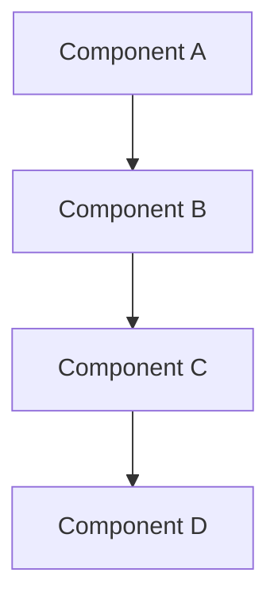
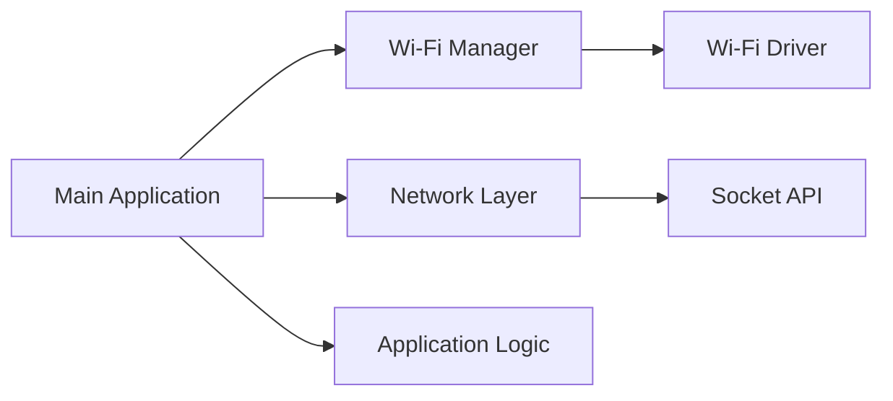
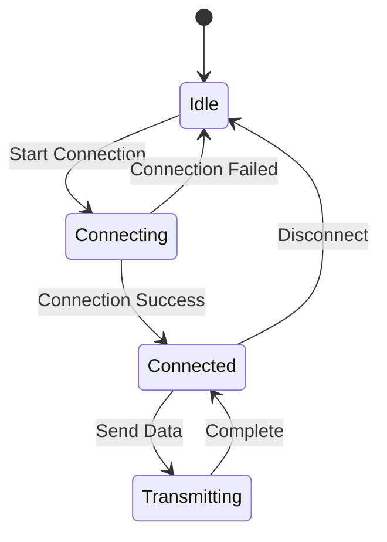
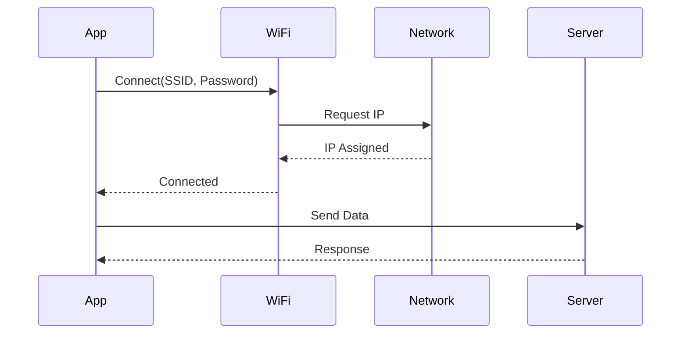

# Project Document Repository (PDR)

## Project Information

- **Project Name**: [Project Name]
- **Project ID**: [Unique ID]
- **Version**: [Semantic Version]
- **Date**: [Creation Date]
- **Author(s)**: [Names]
- **Status**: [Draft / In Review / Approved / Archived]

---

## 1. Requirements Specification

### 1.1 Functional Requirements

| ID | Requirement | Priority | Status |
|----|-------------|----------|--------|
| FR-001 | Requirement description | High/Medium/Low | Pending/Implemented/Verified |
| FR-002 | Requirement description | High/Medium/Low | Pending/Implemented/Verified |

### 1.2 Non-Functional Requirements

#### Performance
- **Metric 1**: Specification (e.g., latency < 10ms)
- **Metric 2**: Specification (e.g., throughput > 1Mbps)

#### Power Consumption
- **Active Mode**: Target consumption
- **Sleep Mode**: Target consumption
- **Average**: Target consumption

#### Memory
- **Flash**: Target size (e.g., < 256KB)
- **RAM**: Target size (e.g., < 128KB)
- **Heap**: Target size

#### Reliability
- **MTBF**: Mean Time Between Failures
- **Uptime**: Target uptime percentage
- **Error Rate**: Acceptable error rate

### 1.3 Hardware Requirements

| Component | Specification | Quantity | Notes |
|-----------|---------------|----------|-------|
| MCU | Model and variant | 1 | Features required |
| Sensor | Model | X | Interface type |

---

## 2. Architecture Design

### 2.1 System Architecture



**Description**: High-level system architecture overview.

### 2.2 Software Architecture



**Layers**:
- **Application Layer**: Business logic
- **Network Layer**: Communication protocols
- **Driver Layer**: Hardware abstraction
- **RTOS Layer**: Zephyr RTOS

### 2.3 Module Descriptions

#### Module 1: [Name]
- **Purpose**: What it does
- **Inputs**: What it receives
- **Outputs**: What it produces
- **Dependencies**: Other modules it depends on
- **Files**: `module1.c`, `module1.h`

#### Module 2: [Name]
- **Purpose**: What it does
- **Inputs**: What it receives
- **Outputs**: What it produces
- **Dependencies**: Other modules it depends on
- **Files**: `module2.c`, `module2.h`

### 2.4 State Machines



### 2.5 Sequence Diagrams



---

## 3. API Documentation

### 3.1 Module 1 API

#### Function: `function_name()`

**Purpose**: Brief description

**Prototype**:
```c
int function_name(param_type param1, param_type param2);
```

**Parameters**:
- `param1`: Description
- `param2`: Description

**Return Values**:
- `0`: Success
- `-ERRNO`: Error description

**Example**:
```c
int result = function_name(value1, value2);
if (result < 0) {
    LOG_ERR("Function failed: %d", result);
}
```

**Notes**: Additional information, constraints, or warnings

---

## 4. Configuration Guide

### 4.1 Kconfig Options

| Option | Type | Default | Description |
|--------|------|---------|-------------|
| `CONFIG_FEATURE1` | bool | n | Enable feature 1 |
| `CONFIG_PARAM1` | int | 1000 | Parameter description |
| `CONFIG_PARAM2` | string | "default" | Parameter description |

### 4.2 Device Tree Configuration

```dts
/ {
    custom_node {
        compatible = "vendor,device";
        property1 = <value>;
        property2 = <value>;
    };
};
```

### 4.3 Build Configurations

**Default Build**:
```bash
west build -p -b board_name
```

**Feature-Specific Builds**:

| Configuration | Overlay File | Use Case |
|---------------|--------------|----------|
| Feature 1 | `overlay-feature1.conf` | Description |
| Feature 2 | `overlay-feature2.conf` | Description |

---

## 5. Test Plan

### 5.1 Test Strategy

- **Unit Tests**: Module-level testing
- **Integration Tests**: Inter-module testing
- **System Tests**: End-to-end testing
- **Performance Tests**: Benchmarking

### 5.2 Test Cases

#### TC-001: [Test Case Name]

**Objective**: What is being tested

**Prerequisites**:
- Precondition 1
- Precondition 2

**Test Steps**:
1. Step 1
2. Step 2
3. Step 3

**Expected Results**:
- Expected outcome 1
- Expected outcome 2

**Actual Results**:
- [To be filled during testing]

**Status**: [Pass / Fail / Not Tested]

**Notes**: Additional observations

### 5.3 Test Results Summary

| Test ID | Description | Status | Date | Tester |
|---------|-------------|--------|------|--------|
| TC-001 | Test description | Pass/Fail | Date | Name |
| TC-002 | Test description | Pass/Fail | Date | Name |

### 5.4 Coverage Metrics

- **Code Coverage**: XX%
- **Branch Coverage**: XX%
- **Function Coverage**: XX%

---

## 6. User Manual

### 6.1 Getting Started

#### Hardware Setup
1. Step-by-step hardware assembly
2. Connections and wiring
3. Power requirements

#### Software Setup
1. Development environment setup
2. Building the firmware
3. Flashing instructions

### 6.2 Operation Guide

#### Normal Operation
1. Power on sequence
2. Configuration steps
3. Operating procedures

#### Advanced Features
- Feature 1 usage
- Feature 2 usage

### 6.3 Troubleshooting

| Symptom | Possible Cause | Solution |
|---------|---------------|----------|
| Issue 1 | Cause description | Resolution steps |
| Issue 2 | Cause description | Resolution steps |

### 6.4 FAQ

**Q: Question 1?**
A: Answer description

**Q: Question 2?**
A: Answer description

---

## 7. Maintenance and Updates

### 7.1 Version History

| Version | Date | Author | Changes |
|---------|------|--------|---------|
| 1.0.0 | Date | Name | Initial release |
| 1.1.0 | Date | Name | Feature additions |

### 7.2 Known Issues

| Issue ID | Description | Severity | Workaround | Status |
|----------|-------------|----------|------------|--------|
| ISS-001 | Issue description | High/Medium/Low | Workaround | Open/Fixed |

### 7.3 Roadmap

- **Version X.X**: Planned features
- **Future**: Long-term plans

---

## 8. References

### 8.1 Internal Documents
- [Document Name](link)
- [Document Name](link)

### 8.2 External Resources
- [Nordic nRF Connect SDK Documentation](https://developer.nordicsemi.com/)
- [Zephyr Project Documentation](https://docs.zephyrproject.org/)
- [Relevant Standards or Specifications]

### 8.3 Related Projects
- [Project Name](link)
- [Project Name](link)

---

## 9. Appendices

### Appendix A: Glossary

| Term | Definition |
|------|------------|
| Term 1 | Definition |
| Term 2 | Definition |

### Appendix B: Abbreviations

| Abbreviation | Full Form |
|--------------|-----------|
| NCS | nRF Connect SDK |
| PDR | Project Document Repository |

### Appendix C: Schematics

[Include circuit diagrams, pinout diagrams, etc.]

### Appendix D: Code Examples

[Include relevant code snippets or examples]

---

**Document Control**:
- **Last Updated**: [Date]
- **Review Cycle**: [Quarterly / Annually]
- **Next Review**: [Date]
- **Approvers**: [Names and Roles]
